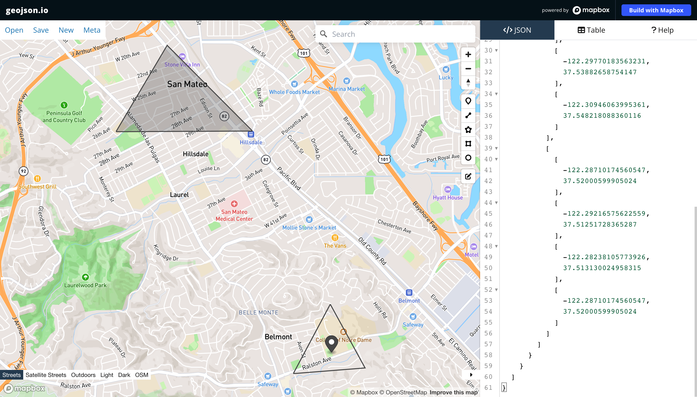
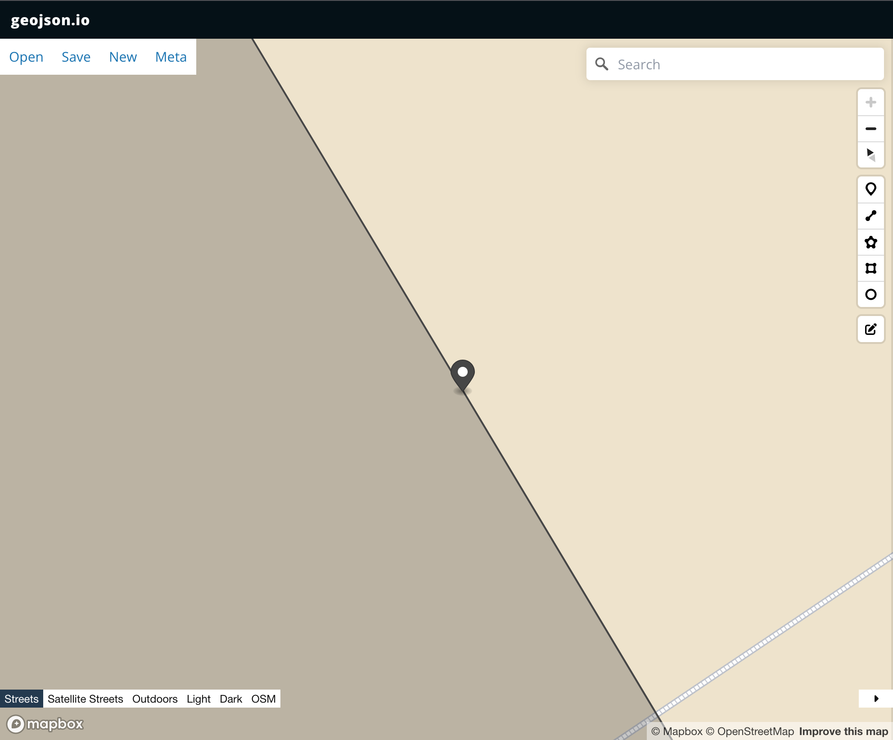
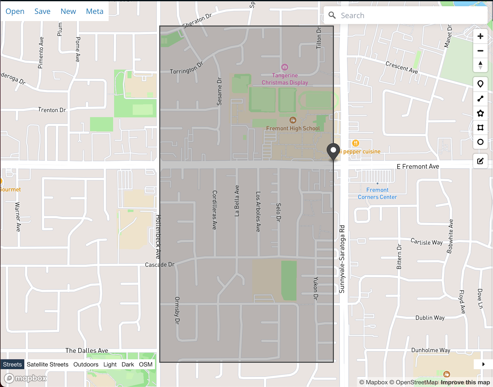

# take-home-phlebotomist

By default, queries the site every second per clinicianId. If it gets an unexpected response or the clinician is out of bounds, sends an email and then waits for 2-3 seconds before querying again (and sending warnings). How frequently it queries and how long it waits after sending a warning email can be changed in `configs.json.`

## To Use 
1. Install shapely: `pip install shapely`
2. For sending from gmail, we need to create an app password instead of using the email's actual password. Please follow the directions [here](https://support.google.com/accounts/answer/185833?hl=en).  
3. Update the `password` field in the `configs.json` (if running more than once) or remember the app password and enter it later when running the program. 
4. Update the ids in `clinicianID.txt` if needed and any other `configs.json` setting if needed. 
5. Run: `python main.py` (run `python main.py -d` for debugging messages)

## Notes
To run all tests: `python3 -m unittest -v` (`-v` is optional but tells us the exact tests that have been run)

I took some liberations:

1. For some queries, there were unexpected cases of where multiple polygons were given. I assumed that if the clinician was in one of polygons, the clinician was NOT out of bounds. Here's an example:
  ```
  {"type":"FeatureCollection","features":[{"type":"Feature","properties":{},"geometry":{"type":"Point","coordinates":[-122.28693008422852,37.51483205774519]}},{"type":"Feature","properties":{},"geometry":{"type":"Polygon","coordinates":[[[-122.30946063995361,37.548218088360116],[-122.31645584106445,37.53875852887022],[-122.29770183563231,37.53882658754147],[-122.30946063995361,37.548218088360116]],[[-122.28710174560547,37.52000599905024],[-122.29216575622559,37.51251728365287],[-122.28238105773926,37.513130024958315],[-122.28710174560547,37.52000599905024]]]}}]}
  ```
 
 
2. **Gave the clinician `epsilon` slack**: In one case, the clinician was really, really close to the border. Thus, I gave the clinicians `epsilon` allowance; if they were less `epsilon` away from a polygon border, I would not send a warning email. By default, `epsilon` is 1e-12. 
Here's an example of when the clinician was around 1e-14 from the polygon border:
```
{"type": "FeatureCollection", "features": [{"type": "Feature", "properties": {}, "geometry": {"type": "Point", "coordinates": [-122.03287124633789, 37.35232882898717]}}, {"type": "Feature", "properties": {}, "geometry": { "type": "Polygon", "coordinates": [[[-122.04145431518556, 37.344368504994286], [-122.0328712463379, 37.344368504994286], [-122.0328712463379, 37.35760507144896], [-122.04145431518556, 37.35760507144896], [-122.04145431518556, 37.344368504994286]]]}}]}
```

Zoomed In            |  Zoomed Out
:-------------------------:|:-------------------------:
  |  

To not give this slack, simply change `epsilon` to 0 :blush:

#### Possible Extensions 
1. Create an image of the clinicians that are out of bounds and attach them to emails. 
2. Remember the previous response, and if the current response is the same as previous, don't do anything (ie. don't send the same repeated warnings)
4. Store the password more securely. 
5. Use a database for the clinicianIds.
6. Create an interface so that it's easier to change who is monitored and not. Right now, it's just in a text file. 
3. Currently, using a thread for each unique clinicianId, but we can change the architecture when there are more clinicianIds. 

